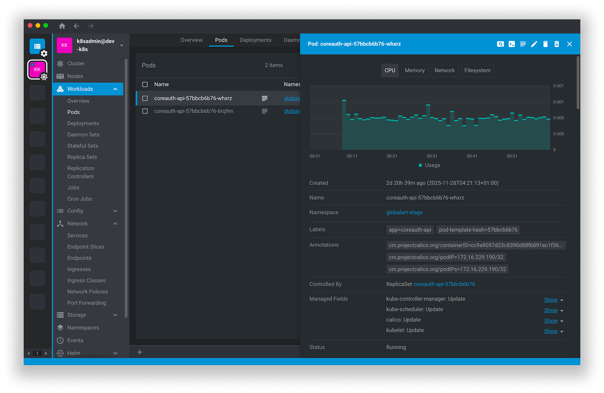

k8sight is a free and open-source user interface designed for managing Kubernetes clusters. It provides a standalone application compatible with macOS, Windows, and Linux operating systems, making it accessible to a wide range of users. The application aims to simplify the complexities of Kubernetes management by offering an intuitive and user-friendly interface.

